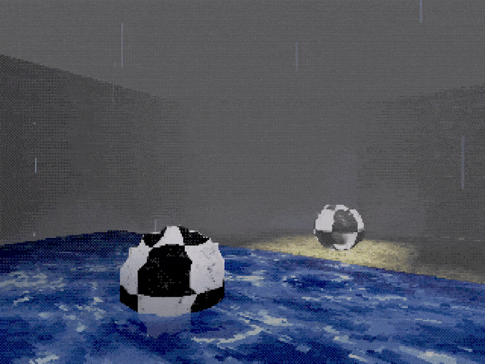

# PSX Shader Pack for Unity (BRP)

  

A collection of PlayStation 1-inspired shaders for Unity's **Built-in Render Pipeline (BRP)**, designed to replicate the visual quirks and style of early 3D console graphics. This pack includes fog effects, vertex jittering (material based), dithered transparency, pixelation, and color quantization — capturing the distinct low-fidelity charm of the PSX era.

---

## Features

- **Affine Texture Distortion Simulation**  
  Vertex jittering mimics PS1's lack of sub-pixel accuracy, it's material based instead of post-processing.

- **Depth-Based Fog**  
  Customizable fog effect with optional sky coverage override.

- **Post-Processing Effects**  
  Bayer dithering, color quantization, and resolution downscaling.

- **Water Shader**  
  UV-distorting animated water surface with waves, ripples, and color banding.

- **Dithered Transparency**  
  Bayer matrix dithering for alpha simulation, useful for stylized transparency.

- **Surface Shaders for Opaque and Transparent Materials**  
  Includes jittered geometry and per-pixel quantization.

- **Paricle Sample**  
  Includes rain and mist particles in sample scene.

- **Extra Scripts**
  Includes simple first person controller and light probe generator!

---

## Included Shaders

| Shader                                  | Type          | Description                                                                 |
|-----------------------------------------|---------------|-----------------------------------------------------------------------------|
| `Hidden/PSXFog`                         | Post-Process  | Fog using depth texture with sky override support.                          |
| `Hidden/PSX_PostFX`                     | Post-Process  | Color quantization + Bayer dithering + pixelation/downscaling.             |
| `PSX/PSX_Material_Opaque`               | Surface       | Opaque shader with vertex jitter and albedo tinting.                        |
| `PSX/PSX_Material_DitherTransparent`    | Surface       | Transparent shader with dithered alpha blending.                            |
| `PSX/PSX_Material_Water`                | Surface       | Animated water shader with UV distortion, ripple waves, and quantization.  |

---

## Tested On

- Tested using Unity 2021.3 and Unity 6
- Built-in Render Pipeline (BRP)
- **Depth Texture** enabled in camera settings (for fog shader)

> ⚠️ Not compatible with URP or HDRP.

---

## Getting Started

1. Import the shaders into your Unity BRP project.
2. Apply surface shaders (e.g., `PSX_Material_Opaque`) to your 3D models.
3. Use `PSXFog` and `PSX_PostFX` in a full-screen Blit pass (e.g., via command buffer or custom image effect).
4. Tune parameters like `JitterIntensity`, `ColorDepth`, and `FogDistance` to match your desired retro look.
5. Demo scene included on this assets

---

## License

**MIT License**  
Free to use, modify, and distribute.  
Attribution is appreciated but not required.

---
